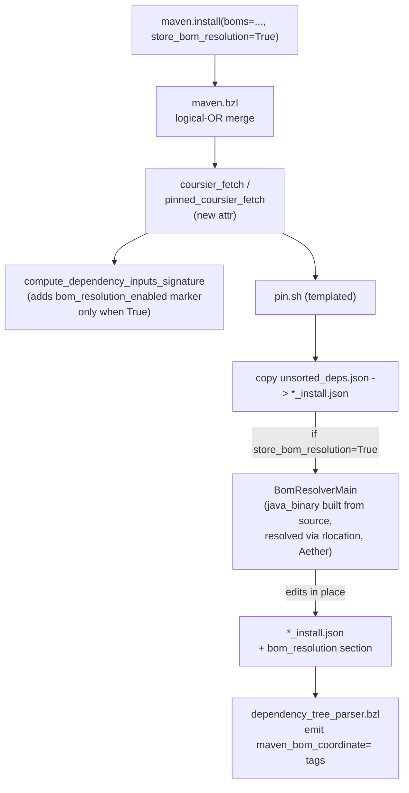

## Architecture at a glance



## 1. Java: new `BomResolverMain` + `BomResolver`

Create a new package `private/tools/java/com/github/bazelbuild/rules_jvm_external/resolver/bom/`:

- `BomResolver.java` — pure logic, no I/O.
  - `Map<String, List<String>> buildBomResolutionMapping(List<URI> repos, List<String> bomCoords, List<Coordinates> versionlessArtifacts, @Nullable Path netrc)`
  - `Set<Coordinates> getEffectiveManagedDependencies(RepositorySystem sys, RepositorySystemSession session, List<RemoteRepository> repos, String bomCoord)` — issue an Aether `ArtifactDescriptorRequest` for each BOM (see existing pattern in [`MavenResolver.resolveArtifactsFromBoms`](private/tools/java/com/github/bazelbuild/rules_jvm_external/resolver/maven/MavenResolver.java) lines 481–502) and walk `result.getManagedDependencies()`.
  - Algorithm:
    1. For each BOM in declaration order, compute its managed-deps set.
    2. For each versionless artifact, iterate BOMs in declaration order; if managed, append BOM coord to the artifact's list.
    3. Dedup by exact BOM coord; if same `g:a` appears with different versions across the input list, first-declared wins (caller pre-dedups so this is mostly defensive).
    4. Key format per spec: `g:a` for default jar/no-classifier, else `g:a:packaging[:classifier]`.

- `BomResolverMain.java` — CLI entry point.
  - Args (per spec section "BomResolverMain CLI Contract"): repeatable `--boms=`, `--repositories=`, `--artifacts=`; `--lock-file=` (required, in-place); optional `--netrc=`.
  - Reads existing lock file as a Gson `JsonObject` (so we preserve unknown keys & ordering as much as possible).
  - Calls `BomResolver.buildBomResolutionMapping(...)`.
  - Inserts/replaces `bom_resolution` key. Writes back with the same `Gson` formatting used by `V3LockFile.render()` callers.
  - Exit code non-zero with descriptive `stderr` on any Aether failure (no partial write).

- BUILD targets in a new `private/tools/java/com/github/bazelbuild/rules_jvm_external/resolver/bom/BUILD`:
  - `java_library(name = "bom", srcs = ["BomResolver.java"], deps = [...Aether, lockfile, Coordinates...])`.
  - `java_binary(name = "BomResolverMain", srcs = ["BomResolverMain.java"], main_class = "...BomResolverMain", deps = [":bom", "@maven//:com_google_code_gson_gson", ...], visibility = ["//visibility:public"])`.
  - Reuse Aether deps already declared in the existing `private/tools/java/com/github/bazelbuild/rules_jvm_external/resolver/maven/BUILD` (`org.eclipse.aether:*`, `maven-resolver-*`). No prebuilt jar.

## 2. No prebuilt jar — built from source

Unlike `hasher_deploy.jar` / `lock_file_converter_deploy.jar` / `outdated_deploy.jar`, **`BomResolverMain` is not added to `private/tools/prebuilt/`**. Reason: those existing prebuilt jars must run from inside a Bazel `repository_rule` (`coursier_fetch`) at fetch time, before any normal target can be built — repository rules cannot consume `java_binary` outputs directly.

`BomResolverMain` does not have that constraint: it runs from the `pin` target, which is a `sh_binary` defined in the unpinned repo's generated `BUILD` (see `_BUILD_PIN` at [`private/rules/coursier.bzl`](private/rules/coursier.bzl) lines 72–87). That `sh_binary` runs as a normal Bazel `bazel run` target — so it can take a `data` dep on the source-built `java_binary` and resolve it via `rlocation`, exactly the way `pin_dependencies.bzl` (line 89, 101, 133–137) already handles `Resolver`:

```python
"resolver": attr.label(
    executable = True,
    cfg = "exec",
    default = "//private/tools/java/com/github/bazelbuild/rules_jvm_external/resolver/cmd:Resolver",
),
```

This avoids: (a) bloating the prebuilt set, (b) the manual `scripts/refresh-prebuilts` step every time `BomResolver` changes, and (c) any version-skew between the prebuilt jar and the Java sources.

`scripts/refresh-prebuilts` is **unchanged**.

## 3. `coursier.bzl` — new attribute, hash marker, pin.sh wiring

In [`private/rules/coursier.bzl`](private/rules/coursier.bzl):

- Add `store_bom_resolution = attr.bool(default = False)` to **both** `coursier_fetch` (around line 1666) and `pinned_coursier_fetch` (around line 1643).
- **No `_bom_resolver` private label attr on the repository rule.** Instead, the `BomResolverMain` `java_binary` label is referenced directly from the generated `_BUILD_PIN` (next bullet).
- Modify [`compute_dependency_inputs_signature`](private/rules/coursier.bzl) (lines 371–411): when the caller passes `store_bom_resolution=True`, add a stable key `"bom_resolution_enabled": True` to the returned `all_hashes` dict. **Asymmetric:** when `False`, do not add the key at all (preserves existing hashes for non-adopters). Update both call sites (1451–1456 and `_pinned_coursier_fetch_impl` 638–666) to forward the flag.
- In `_pinned_coursier_fetch_impl`, after consuming the lock file, validate per spec:
  - attr `True` + section missing → `fail(...)` with "stale lock file, please repin".
  - attr `False` + section present → `print("WARNING: ...")`.
- Update `_BUILD_PIN` (lines 72–87) to conditionally include the BomResolver `java_binary` as a runtime dep of the `pin` `sh_binary`. Two-template approach: keep the existing `_BUILD_PIN` for the `False` case; add a `_BUILD_PIN_WITH_BOM` variant that adds the source-built target to `data` and an additional positional arg pointing at it via `rlocationpath`. Pattern mirrors the existing `_BUILD_OUTDATED` (lines 97–115) which already references `@rules_jvm_external//private/tools/java/...` (well, currently a prebuilt; here we'd reference the `java_binary` directly):

```python
_BUILD_PIN_WITH_BOM = """
sh_binary(
    name = "pin",
    srcs = ["pin.sh"],
    args = [
        "$(rlocationpath :unsorted_deps.json)",
        "$(rlocationpath @rules_jvm_external//private/tools/java/com/github/bazelbuild/rules_jvm_external/resolver/bom:BomResolverMain)",
        "{bom_resolver_args_file}",
    ],
    data = [
        ":unsorted_deps.json",
        ":bom_resolver_args",
        "@rules_jvm_external//private/tools/java/com/github/bazelbuild/rules_jvm_external/resolver/bom:BomResolverMain",
    ],
    deps = ["@bazel_tools//tools/bash/runfiles"],
    visibility = ["//visibility:public"],
)
"""
```

- Write a `bom_resolver_args` file inside the unpinned repo (using `repository_ctx.file(...)`) containing the `--boms=`, `--repositories=`, `--artifacts=`, `--netrc=` lines (one per line, like an argsfile). This avoids the OS argv limit concern entirely and keeps the generated `BUILD` clean.
- Filter the `--artifacts=` list to versionless requested artifacts only, after removing `excluded_artifacts` and `override_targets` (Constraint #7). Compute this filter in Starlark before writing the args file.

## 4. `pin.sh` change

Modify [`private/pin.sh`](private/pin.sh) to optionally accept two extra positional args (`$2` = path to `BomResolverMain` runfile, `$3` = path to args file). When present, after the `cp` at line 24, invoke:

```bash
if [[ -n "${2:-}" ]]; then
  bom_resolver_runfile=$(rlocation "${2#external\/}")
  bom_args_file=$(rlocation "${3#external\/}")
  "$bom_resolver_runfile" \
    --lock-file="$maven_install_json_loc" \
    @"$bom_args_file"
fi
```

Note `$bom_resolver_runfile` is the executable wrapper script that `java_binary` produces, not a `java -jar` invocation — so we don't need `JAVA_HOME` plumbing or to know where Bazel staged the jar. The `@argsfile` form is supported by standard JCommander/picocli arg parsers; if our hand-rolled CLI doesn't, expand the file in bash with `xargs` instead. Either way, this fully decouples invocation from a prebuilt jar.

Example contents of the args file rendered into the unpinned repo:

```
--boms=com.google.cloud:libraries-bom:26.59.0
--boms=org.springframework.boot:spring-boot-dependencies:3.5.14
--repositories=https://repo1.maven.org/maven2/
--artifacts=com.google.auth:google-auth-library-oauth2-http
--artifacts=ch.qos.logback:logback-classic
```

## 5. `maven.bzl` — logical-OR merge

In [`private/extensions/maven.bzl`](private/extensions/maven.bzl):

- Add `store_bom_resolution = attr.bool(default = False)` to the `install` tag (around line 122).
- In the per-repo merge logic (lines 583–651), use the existing `_logical_or` helper (lines 158–160) on `store_bom_resolution`. Override the normal "root wins" precedence in the lock-file/root-only override pass (lines 664–686) to use OR specifically for this field.
- Forward to both `coursier_fetch(store_bom_resolution=...)` (line 724-area) and `pinned_coursier_fetch(store_bom_resolution=...)` (line 790-area).
- Also forward to the maven/gradle pin path: in [`pin_dependencies.bzl`](private/rules/pin_dependencies.bzl), add a sibling `bom_resolver` label attr (mirroring the existing `resolver` attr at lines 133–137):

```python
"bom_resolver": attr.label(
    executable = True,
    cfg = "exec",
    default = "//private/tools/java/com/github/bazelbuild/rules_jvm_external/resolver/bom:BomResolverMain",
),
```

Extend `_TEMPLATE` (lines 16–19) so when `store_bom_resolution=True` an additional line is appended:

```bash
{bom_resolver_cmd} --lock-file={output} @{bom_args_file}
```

…and merge `ctx.attr.bom_resolver[DefaultInfo].default_runfiles` into the script's runfiles (line 101). Same source-built `java_binary`, no prebuilt.

## 6. v3 lock file render/parse

- Starlark [`private/rules/v3_lock_file.bzl`](private/rules/v3_lock_file.bzl):
  - In `_render_lock_file` (278–313), if `bom_resolution` is present in the parsed contents, include it in the rendered map.
  - In `_compute_lock_file_hash_v3` (134–159) — leave unchanged; the section is annotation-only (Constraint: "does not affect resolved artifact hashes").
  - Add `get_bom_resolution(lock_file_contents)` accessor to the exported `v3_lock_file` struct (326–336).
  - Empty-file/`{}` tolerance (Constraint #13): audit `_get_input_artifacts_hash`, `_get_artifacts`, `_get_dependencies` and ensure they treat an empty dict as "no data".
- Java [`V3LockFile.java`](private/tools/java/com/github/bazelbuild/rules_jvm_external/resolver/lockfile/V3LockFile.java):
  - In `create(String json)` (72–181): parse optional top-level `bom_resolution` map into a new field `Map<String, List<String>> bomResolution`.
  - In `render()` (183–290): if non-empty, emit `"bom_resolution": bomResolution` between `conflict_resolution` (276–284) and `files` (~285).
  - Tolerate empty input / `{}` (Constraint #13) — likely just guard the existing field reads with default-empty.
- [`LockFileConverter.java`](private/tools/java/com/github/bazelbuild/rules_jvm_external/coursier/LockFileConverter.java) does not need changes: BOM resolution is added as a separate post-pin pass.

## 7. `dependency_tree_parser.bzl` — emit tags

In [`private/dependency_tree_parser.bzl`](private/dependency_tree_parser.bzl) `_generate_target` (88–421), after line 231 (`maven_coordinates=...`):

```python
for bom_coord in artifact.get("bom_coordinates", []):
    target_import_string.append("\t\t\"maven_bom_coordinate=%s\"," % bom_coord)
```

And the same after line 590 (POM-only `java_library` fallback).

To make `bom_coordinates` appear on each `artifact` dict, update `v3_lock_file._get_artifacts` (v3_lock_file.bzl:214–273) to look up the artifact's key (using the spec's key-format rule) in the lock file's `bom_resolution` map and attach the list.

Example generated output:

```python
jvm_import(
    name = "com_google_auth_google_auth_library_oauth2_http",
    tags = [
        "maven_coordinates=com.google.auth:google-auth-library-oauth2-http:1.23.0",
        "maven_bom_coordinate=com.google.cloud:libraries-bom:26.59.0",
        "maven_bom_coordinate=org.springframework.boot:spring-boot-dependencies:3.5.14",
        ...
    ],
)
```

## 8. Tests

### Java unit tests (`tests/com/github/bazelbuild/rules_jvm_external/resolver/bom/BomResolverTest.java`)
Per spec Testing > Java Tests — registered as `java_test` (not `java_binary`) per anti-faking guardrail #6:
- `testEmptyInputs`, `testNoMatchingArtifacts`, `testSingleBomManagesArtifact` (junit-bom 5.10.0), `testMultipleBomsSameArtifact`, `testRecursiveImportedBoms` (libraries-bom), `testDirectAndTransitiveBomDeduped`, `testVersionedArtifactsIgnored`, `testNonDefaultPackagingKeyFormat`, `testMultipleRepositories`, `testHardFailOnResolutionError`.

### Starlark unit tests ([`tests/unit/coursier_test.bzl`](tests/unit/coursier_test.bzl))
Add via the existing `add_test(...)` pattern (lines 14–19):
- `bom_resolution_flag_changes_input_hash_test` — calls `compute_dependency_inputs_signature` twice and asserts `asserts.false(env, hash_off == hash_on)`.
- `bom_resolution_flag_marker_present_when_enabled_test` — exact equality on the dict containing `"bom_resolution_enabled": True`.
- `bom_resolution_flag_marker_absent_when_disabled_test` — `asserts.false(env, "bom_resolution_enabled" in dict)`.

### Integration tests ([`tests/bazel_run_tests.sh`](tests/bazel_run_tests.sh))
Add new repos in `MODULE.bazel` and corresponding `function test_xxx()` blocks. Each follows the anti-faking pattern: `echo '{}' > <lock-file>` reset → `REPIN=1 bazel run @repo//:pin` → `jq` exact assertions.
- `test_coursier_resolution_with_boms`, `test_maven_resolution_with_boms`, `test_multiple_boms_emit_multiple_tags`
- `test_coursier_resolution_without_bom_resolution` (asserts no `bom_resolution` key AND no `bom_resolution_enabled` in `__INPUT_ARTIFACTS_HASH`)
- `test_v2_lock_file_with_bom_resolution_errors`, `test_unresolvable_bom_aborts_pin`
- `test_pinned_fetch_errors_when_attr_true_section_missing`, `test_pinned_fetch_warns_when_attr_false_section_present`
- `test_jvm_import_bom_tags`

### Smoke / break-and-revert
After implementation, temporarily make `BomResolver.buildBomResolutionMapping` return `Collections.emptyMap()` and confirm integration tests fail loudly (per spec Anti-Faking section).

## Implementation example: hash marker (asymmetric)

Within `compute_dependency_inputs_signature`:

```python
def compute_dependency_inputs_signature(boms, artifacts, repositories, excluded_artifacts, store_bom_resolution = False):
    all_hashes = {}
    # ... existing logic ...
    if store_bom_resolution:
        all_hashes["bom_resolution_enabled"] = True
    return all_hashes, [v1_legacy_sig, v2_legacy_sig]
```

This guarantees existing users see byte-identical hashes (no churn) and adopters see a hash bump exactly once when toggling on.
